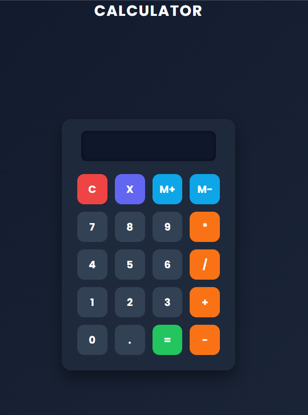

# javascript-calculator
Simple calculator web application using HTML, CSS, and JavaScript.

## Features

- Perform basic arithmetic operations
- Responsive design
- User-friendly interface

- ## Tech Stack

- HTML5
- CSS3
- JavaScript
- ## Screenshot
- 

- ## Live Demo
-  https://ajaiswal-u.github.io/javascript-calculator/
